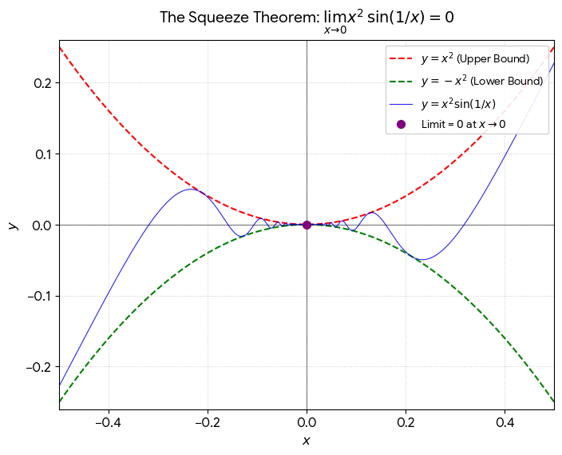

# Chapter 1, 2 Guided Notes (AP Calc BC)

## Chapter 1

## Chapter 2

### 2.2.3

Three conditions of continuity: 

1. \(\lim_{x\to a} f(x)\) exists.
2. \(f(a)\) exists.
3. \(\lim_{x\to a} f(x)= f(a)\) 

### Sqeaze Theorem

If a function is trapped between two other functions and the two "outer" functions approach the same point, the middle function must also approach the same limit.

\(f(x) \le g(x) \le h(x)\)

If \(\lim_{x \to c} f(x) = \lim_{x \to c} h(x) = L\), then \(\lim_{x \to c} g(x) = L\).

**Evaluating \(\lim_{x \to 0} \frac{sin x}{x}\)**